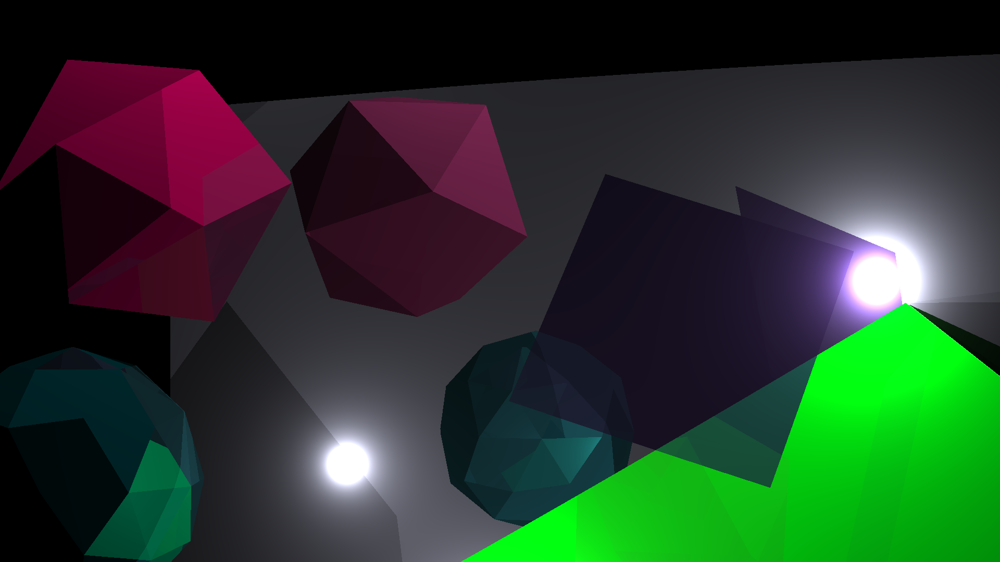

# OBJ PathTracer
### A javascript implementation for pathtracing .obj models.

---
## Setup and Usage
 1. Download and install [node.js](https://nodejs.org/en/).
 2. Download or clone this repository.
 3. Configure the pathtracer by editing the config.js file.
 4. Run the pathtracer.cmd file.

This pathtracer is very un-optimized compared to other libraries. Large triangle counts will greatly affect render time. I hope to resolve this sometime in the future.

## Examples

|  
Image
 | 
Files
 |
| :----: | :----: |
|  | [blender file](/meshes/blend/geometryScene.blend) &#x7c; [obj file](/meshes/geometryScene.obj)|
|  | [blender file](/meshes/blend/carModel.blend) &#x7c; [obj file](/meshes/carModel.obj)    [view car asset](https://sketchfab.com/3d-models/mazda-rx-7-27c2c828e9ca4ca3a408018007a10db8)  |
|  | [blender file](/meshes/blend/carModel2.blend) &#x7c; [obj file](/meshes/carModel2.obj)    [view car asset](https://sketchfab.com/3d-models/2007-koenigsegg-ccx-no-roof-423b64e085974b97b5cfd5a87d9dcce3)  |

